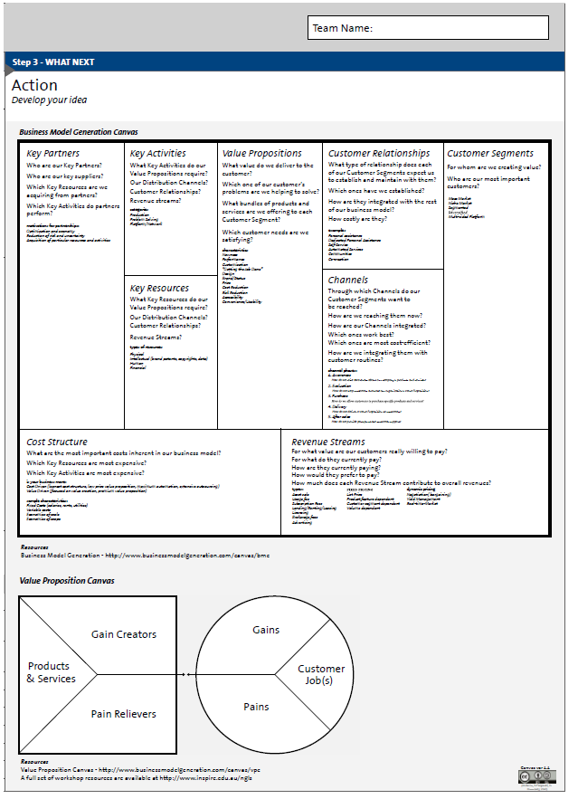

# 2.3 Kreatives Denken für eine andere Zukunft

Einer der schwierigsten Aspekte für viele Akteure in einem
Lernraumprojekt ist es, sich Räume vorzustellen, die sich sehr von denen
unterscheiden, in denen sie unterrichtet wurden oder einen Großteil
ihres Arbeitslebens verbracht haben. Es ist einfach sich existierende
Räume vorzustellen, die heller und besser möbliert sind, aber
schwieriger einen Plan für eine radikal andere Art von Lernerlebnis zu
entwickeln. Dies kann genauso für Architekten gelten, deren Erfahrung
mit Hochschulbildung möglicherweise relativ traditionell war: sie können
architektonisch stimulierende Gebäude entwerfen, brauchen aber eine
Menge Input von Mitarbeitern und Studierenden damit diese als Lernräume
des 21. Jahrhunderts funktionieren. Bruce Rodger, Head of
Infrastructure, University of Strathclyde, betont die Notwendigkeit der
Institution, über ihre eigene Vision und was sie erreichen will,
nachzudenken bevor sie externe Berater hinzuzieht: „Manchmal werden
Architekten etwas zu früh im Prozess eingebunden. Wir müssen sorgfältig
über die wesentlichen Nutzungen des Raumes nachdenken, bevor
Designkonzepte in Stein gemeißelt werden.“

Die gute Nachricht ist, dass kreatives Denken eine Fähigkeit ist, die
sich entwickeln kann und es viele Techniken gibt, die das unterstützen,
wie z.B. der Learning Space Canvas[^2]:

 

Abbildung 3: The Learning Space Canvas

Die Nutzung von Metaphern kann hilfreich sein, um Stakeholder dazu
anzuregen, einen frischen Blick auf die Ideen eines Lernraums und die
Einrichtungen, Aktivitäten und Zusammenhänge zwischen ihnen zu werfen.
An der Glasgow Caldonian University wurden bei der Entwicklung des
Saltire Centre Metaphern genutzt, wie z.B. das Erdgeschoss als Stadt und
Markplatz, die erste Ebene mit 3 Eingängen und Ausgängen als Abflughalle
eines Flughafens und andere, ruhigere Ebenen als heimischer Garten und
Wohnzimmer. An der University of Birmingham wurde die Metapher eines
durch ein Gebäude wachsenden Baums genutzt um Ideen anzuregen, die das
Innere nach draußen tragen und das Äußere nach innen. An der
Loughborough University enthielt der Beratungsprozess für den Design
School Hörsaal einen Workshop, bei dem Teilnehmer mit Hilfe von
Knetmasse eine Metapher entwickelten.

Ein Beispiel zur Nutzung einer Metapher, angelehnt an die Arbeit von
Martin (2010) über Kreativität:

Lade Stakeholder dazu ein, über eine passende Metapher für den Lernraum
nachzudenken und die Art der Aktivitäten aufzulisten, die ihnen dazu
einfallen. Z.B. könnten sie einen Garten wählen und Dinge auflisten, die
man mit einem Garten tun kann, wie z.B.

-   Beobachten und zusehen, was passiert

-   Alles umgraben und von neuem beginnen

-   Ihn erkunden, Unkraut jäten, aufräumen

-   Dinge hinzufügen, wegnehmen oder ersetzen

-   Wände und Zäune bauen

-   Wege schaffen

-   Neu organisieren, neue Gruppen machen, Dinge verrücken

-   Vielfalt an Blumen, Gemüse und Obst wachsen lassen

-   Vögeln und Bienen lauschen

-   In der Sonne liegen und nachdenken

-   Grillen

-   Aussicht einrahmen oder verändern

Als nächstes sollen sie die Metapher auf die reale Situation anwenden
und die Gartenideen dem Lernraum überstülpen. Was sind die Auswirkungen
auf den Raum? Einige Beispiele können sein:

-   Alles umgraben und von neuem beginnen – riskieren wir, ein
    wertvolles Habitat oder wichtiges Teil des Ökosystems wegzunehmen?
    Welche unerwünschten Unkräuter treten auf, wenn wir nicht genug
    Instandhaltung machen?

-   Wände und Zäune bauen – ist es sinnvoll Wände und Zäune um
    Lernbereiche zu haben? Ist dies unverzichtbare Zonierung oder ein
    Hindernis für verknüpftes Lernen? Können wir Zäune entfernen oder
    sie meiden, wenn wir wollen? Brauchen wir Tore, Türen und Öffnungen?

-   Wege schaffen, Dinge verbinden, Trittsteine einbauen – Darüber
    nachdenken, wie die Richtung von Wegen/Pfaden die Sicht und die
    Leichtigkeit bestimmte Arbeiten auszuführen zu unterschiedlichen
    Zeiten im Jahr beeinflusst.

-   Vielfalt an Blumen, Gemüse und Obst wachsen lassen – wie machen wir
    den Boden fruchtbar für verschiedene Arten von Lernen

Es gibt eine Vielzahl weiterer Möglichkeiten, die ursprüngliche Idee
eines Gartens aufzugreifen, wie z.B. einen Teich anlegen, Baumwachstum
fördern, einen Sandkasten bauen, eine Schaukel aufhängen… Keine zwei
Gruppen werden sich jemals dieselben Antworten zu dieser Art von Frage
ausdenken, aber es kann sehr hilfreich sein, auf diese Dinge auf eine
andere Art zu schauen, die nicht durch unsere spezifischen
professionellen Perspektiven eingeschränkt ist.

Die University of Birmingham hat auch Pinterest als ein Mittel genutzt
um breite Stakeholder Beteiligung zu unterstützen. Pinterest ist ein
virtuelles „Mood Board“ und Raum für Zusammenarbeit, den die Universität
bei den ersten Designmeetings nutzte um einen ambitionierten Plan für
ein akademisches Gebäude zu entwickeln. Matt Sherlock, Assistant
Director, Learning Environments, University of Birmingham berichtet
“Manchmal muss man Stakeholder mit ungewöhnlichen Ideen zupflastern, um
ihr Interesse zu wecken.“ Matt empfand es als relativ leicht die Leute
dazu zu bringen, sich mit den Ideen auf Pinterest auseinanderzusetzen,
weil sie sich raussuchen können, ob sie das Material einfach passiv
aufnehmen oder teilnehmen und Beiträge von anderen bewerten wollen. Die
Verwendung dieses Tools bot der „Estates“ Abteilung neue Möglichkeiten,
Anforderungen zu betrachten, um diese besser den Architekten
kommunizieren zu können.

Viele Leute finden Pläne von Architekten schwer zu verstehen und haben
Schwierigkeiten sich vorzustellen, wie der Raum in Wirklichkeit aussehen
könnte. Das bedeutet, dass es wichtig ist schon in einem frühen Stadium
eine leicht verständliche visuelle Repräsentation zu haben. Fortschritte
in digitaler Technologie ermöglichen es Architekten viel leichter früher
im Projekt 3D Visualisierungen produzieren zu können.  

   

---

[^2]: This graphic-free version of The Learning Space Canvas is
    reproduced by kind permission of Prof Robert Fitzgerald, INSPIRE
    Centre, University of Canberra. The original can be found here:
    <http://bit.ly/learningspacecanvas>
