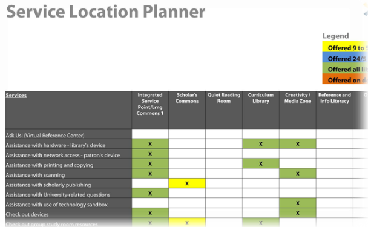
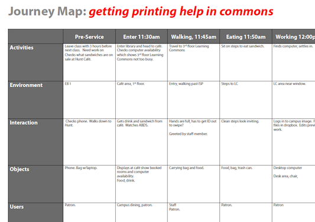

# 6.2 Service Design Prozess

Die Gestaltung von Serviceangeboten innerhalb von Lernräumen erfordert
eine spezielle Denkweise und Tools. Das bedeutet, dass man zunächst die
Nutzer und deren Bedürfnisse berücksichtigt, ganzheitlich plant, die
gesammelten Erfahrungen rechtzeitig durchdenkt und iterativ zwischen den
einzelnen Schritten und Tools arbeitet.

Die Service Design Tools, die dieser Lernraum-Toolkit beinhaltet, sind:

-   [ServicePlot](#service-plot) um die eigene Service Philosophie, Wert
    und Vision zu verstehen

-   [Personas Overview](#_6.2.2_Personas) um die Motivationen und
    Verhalten der Nutzer darzustellen

-   [Service Location Planner](#service-location-planner) um festzulegen
    welche Services wo, wann und durch wen angeboten werden

-   [Customer Journey Map](#journey-map) um die Nutzung von Service/Raum
    über die Zeit aufzuzeichnen und Zeiten der Interaktion oder
    “Berührungspunkte” zu identifizieren.

-   [Service Blueprints](#servicekonzept-blueprint) zur Orientierung,
    wie sowohl „Front-Line“-Mitarbeiter als auch diejenigen hinter den
    Kulissen Service durch verschiedene Kanäle anbieten werden

Zusammengenommen können diese Tools iterativ genutzt werden, um sich
immer wieder gegenseitig zu ergänzen. Zum Beispiel, wenn man einmal
seine Zukunftsvision entwickelt hat, kann man Journey Maps für Personas
erstellen um diese Vision zu veranschaulichen, um daraus wiederum
Erkenntnisse für die Servicekonzepte zu ziehen. Auf dem Weg dorthin wird
man sich immer wieder hin und her bewegen – etwa durch die Pläne etwas
dazulernen, dass einen dazu veranlasst eine neue Journey Map zu
erstellen, ein neues Service Angebot aufzubauen und auszuprobieren oder
sogar seine Vision zu überdenken. Die zu Verfügung gestellten Ressourcen
bieten weitere Einblicke in diese Werkzeuge und wie sie zusammenspielen.

## 6.2.1 Service Plot

*Was ist die eigene Servicephilosophie?*

**ServicePlot** ist ein Tool für Organisationen, um ihre
Servicephilosophie zu erkennen und sich, basierend auf ihren Werten und
Nutzerbedürfnissen, ihre zukünftige Philosophie vorzustellen. Dieses
Tool beinhaltet zwei Hauptfaktoren, die Organisationen auf einem
Spektrum unterschiedlicher Philosophien positioniert, ja nach ihren
Antworten:

-   Verantwortlichkeit: Wofür übernimmt die Organisation Verantwortung
    in Bezug auf Bereitstellen oder Erbringen von Serviceangeboten – von
    der Übernahme der vollen Verantwortung auf der einen Seite hin zu
    der Zusammenarbeit mit Partnern und Nutzern selbst (z.B.
    Selbstbedienung) auf der anderen.

-   Angebot: wie und wo werden Services angeboten – mit einem verteilten
    „Push“-Modell auf der einen Seite und einem zentralisierten „Pull“
    Modell auf der anderen

Beispiel für einen ausgefüllten ServicePlot

Organisationen zeichnen ihre aktuellen und zukünftigen Antworten bezogen
auf sechs Schlüsselthemen ein – Service-Schwerpunkt,
Organisationsstruktur, Schlüsselqualifikationen der Mitarbeiter,
Angebot, Einstellung, Erfolgskriterien. Die daraus resultierende
Darstellung vermittelt ein Bild davon, wo man steht und wo man mit
seinem Service-Angebot hin will. ServicePlot ist nicht als ultimatives
diagnostisches Werkzeug gedacht, sondern eher als Leitfaden zum
Nachdenken und Diskutieren darüber, was die Service-Philosophie momentan
ist und was man sich wünscht – wobei die notwendigen Veränderungen
hervorgehoben und Gespräche auf dem Weg dorthin erleichtert werden.
Einmal festgelegt, können Organisationen ihre Service-Philosophie
nutzen, um ihre Entscheidungsfindungen darüber, welcher Service wo,
wann, wie und durch wen angeboten werden, zu leiten. Als ein flexibles
Werkzeug kann ServicePlot auf verschiedene Arten genutzt werden:

-   Vervollständigungsmethode: diese Fragen können von einer Person, als
    Gruppe, oder als Einzelpersonen in einer Gruppe beantwortet werden,
    die dann ihre Antworten vergleichen und diskutieren.

-   Maßstabsabhängig: man kann die Fragen in Bezug auf die
    Gesamtorganisation beantworten (als Ausgangspunkt empfohlen), man
    kann sie aber auch in Bezug auf die Philosophie seiner Abteilung
    oder Teams innerhalb der Organisation ausfüllen

-   Perspektive: man beantwortet die Fragen einmal, um den aktuellen
    Stand abzubilden, und ein zweites Mal, um den angestrebten
    zukünftigen Stand abzubilden, was einen Vergleich der beiden
    erlaubt, um eine Diskussion zum Organisationswandel zu leiten.

**Ressourcen zum
Erarbeiten einer Vision**

-   [Auswahl von Tools](http://www.upyourservice.com/learning-library/customer-service-vision) von UpYourService

-   Einführung von Mindtools zu [Writing Vision and Mission Statements](http://www.mindtools.com/pages/article/newLDR_90.htm)

## 6.2.2 Personas

Personas sind fiktive Charaktere, die geschaffen werden, um bestimmte
Schlüsselmerkmale von Zielbenutzergruppen zu verkörpern. Mit Personas
kann man Nutzerforschungsdaten in Beispielbenutzer verdichten, die
wiederum zur Entwicklung von Use Cases für den Lernraum und zur
Gestaltung von Serviceangeboten verwendet werden können. Personas werden
während des gesamten Prozesses der Gestaltung von Services verwendet,
wenn Tools wie Journey Maps und Servicekonzepte (Blueprints) verwendet
werden. Werkzeuge zur Erstellung von [Personas](#_7.7__Mit) sind im
Abschnitt Evaluation des Lernraum-Toolkits verfügbar.

## 6.2.3 Service Location Planner

Der Service Location Planner ist ein einfaches Werkzeug, um zu planen,
wo und wann Dienstleistungen angeboten werden - innerhalb eines
Lernraums oder virtuell. Zum Beispiel, wo und zu welchen Zeiten werden
vertiefte Rechercheberatungen stattfinden? Das Werkzeug ist im
Wesentlichen eine Tabelle mit Standorten als Spalten und Diensten als
Zeilen. Sie kann einzeln als Tabelle ausgefüllt werden oder in einem
Workshop-ähnlichen Rahmen, z.B. mit Hilfe von Haftnotizen an bestimmten
Orten, um anzuzeigen, wo eine Dienstleistung angeboten wird, sowie mit
Farbcodierung, um anzuzeigen, wann sie angeboten wird. Institutionen
können mit einem Brainstorming beginnen, indem sie eine Liste ihrer
aktuellen und zukünftigen Dienste erstellen und diese dann nach
Standorten organisieren. So kann z.B. festgelegt werden, welche
Leistungen an einem Serviceschalter angeboten werden und welche virtuell
per E-Mail, Telefon und Instant Messaging unterstützt werden sollen.
Dies kann intern, mit Servicepartnern und/oder Mitgliedern des
Designteams erfolgen und wird ein iterativer Prozess sein, der die
Tabelle im Laufe der Zeit verfeinert. Die daraus resultierende Tabelle
wird dazu beitragen, sicherzustellen, dass Raum, Technologie und
Mobiliar die Bereitstellung von Dienstleistungen ermöglichen. Sie kann
auch als Grundlage für die Ressourcenplanung in Bezug auf Personal,
Arbeitsschichten und Fähigkeiten dienen.

**Beispiel und Tool**

[Service Location Planner Example](https://learningspacetoolkit.org/wp-content/uploads/Service-Location-Planner-Example1.pdf)
– Beispiel zum Herunterladen (PDF)

[Service Location Planner Example](https://docs.google.com/spreadsheet/ccc?key=0Atgu2Z3T5KgMdDRabDRUa2dIX1Y5STV2M2J5ak1wN0E)
– Editierbares Template zur eigenen Benutzung. Bitte laden Sie die Datei
als MS-Excel-Datei herunter oder loggen Sie sich in Ihr
Google-Docs-Konto ein, um eine 'Kopie zu erstellen' und direkt zu
bearbeiten.

## 6.2.4 Journey Map

Eine Customer Journey Map ist eine visuelle Darstellung, die zeigt, wie
ein Kunde oder Nutzer eine Dienstleistung im Laufe der Zeit erlebt.
Journey Maps können evaluative Werkzeuge sein, die aktuelle Erfahrungen
diagnostizieren, oder sie können generative Werkzeuge sein, die
gewünschte zukünftige Erfahrungen für noch nicht existierende Dienste
beschreiben. Obwohl sie viele Formen annehmen können, zeigen Journey
Maps in ihrem Kern die Zeit entlang einer X-Achse mit einer Zeitspanne
vor der Dienstleistung, einer Dienstleistungszeitspanne (die in
verschiedene Segmente unterteilt werden sollte) und einer Zeitspanne
nach der Dienstleistung, wobei die Y-Achse die verschiedenen
"Berührungspunkte" zu diesen wichtigen Zeitpunkten anzeigt. Diese
Berührungspunkte sind die Momente, in denen der Benutzer mit
Informationen, Technologie, Möbeln, Raum, Personal und anderen Benutzern
interagiert - oft sind es die Momente, in denen sie in irgendeiner Weise
Unterstützung benötigen. Eine Möglichkeit, diese Berührungspunkte zu
identifizieren oder zu kategorisieren, ist der A E I O U-Rahmen aus der
Ethnographie: Aktivitäten, Environment (Umgebung), Interaktionen,
Objekte und User (Benutzer).

Journey Maps sollten zu einem frühen Zeitpunkt eines Projekts erstellt
und mit einer Reihe von Szenarien durchlaufen werden - mit Blick auf
verschiedene Personas, aktuelle Erfahrungen, zukünftige Erfahrungen in
der Anfangsphase, zukünftige Erfahrungen nach der Etablierung, Zeiten,
in denen alles gut geht, Zeiten, in denen alles schiefgeht, und so
weiter. Diese Journey Maps werden Schlüsselfragen und Absichten für das
Projekt an die Oberfläche bringen und können als Überprüfung für
Servicekonzepte verwendet werden, um sicherzustellen, dass sie alle
Fragen oder Bedenken, die die Journey Maps aufwerfen, beantworten.

**Beispiel und Tool**

[Journey Map Example](https://learningspacetoolkit.org/wp-content/uploads/Journey-Map-Example1.pdf)
– Beispiel zum Herunterladen (PDF).

[Journey Map Template](https://docs.google.com/document/d/1duOctJbuD_LzX-68d-5CfFgiHQtL7mfReihTYDmiKt4/edit)
– Editierbares Template zur eigenen Benutzung. Bitte laden Sie die Datei
als MS-Excel-Datei herunter oder loggen Sie sich in Ihr
Google-Docs-Konto ein, um eine 'Kopie zu erstellen' und direkt zu
bearbeiten.

**Weitere Ressourcen Journey Maps**

-   [Überblick über Tool](http://www.servicedesigntools.org/tools/8) mit Beispielen von Service Design Tools

-   [Template zum Runterladen](http://files.thisisservicedesignthinking.com/tisdt_cujoca.pdf) von This is Service Design Thinking

-   Überblick auf dem [Desonance Blog](http://desonance.wordpress.com/2010/06/16/customer-experience-mapping/)

-   Harvard Business Review Blog Post über [Using Customer Journey Maps](http://blogs.hbr.org/cs/2010/11/using_customer_journey_maps_to.html)

-   Deutscher Blog Post über das Erstellen von Customer Journey Maps: <https://blog.hubspot.de/marketing/customer-journey-map-erstellen>

-   Beispiel des Einsatzes von Journey Mapping aus Brasilien: <http://designthinkingforlibraries.com/journey-mapping>

 

## 6.2.5 Servicekonzept (Blueprint)

Ein Servicekonzept (Blueprint = „Blaupause“) ist ein operatives
Planungsinstrument für die Bereitstellung eines Dienstes, in dem die
physischen Gegebenheiten, die Aktivitäten des Personals und die
Unterstützungssysteme/Infrastruktur festgelegt werden, die für die
Bereitstellung des Dienstes über seine unterschiedlichen Kanäle
erforderlich sind. Um beispielsweise zu planen, wie man Geräte an
Benutzer ausleiht, würde ein Servicekonzept helfen, zu bestimmen, wie
dies am Serviceschalter geschieht, welche Arten von Wartungs- und
Support-Aktivitäten hinter den Kulissen erforderlich sind, wie die
Benutzer über die verfügbaren Geräte informiert werden, wie diese ein-
und ausgecheckt werden und mit welchen Mitteln die Benutzer im Umgang
mit dem Gerät geschult werden.

Servicekonzepte können verschiedene Formen annehmen - einige sind
grafischer als andere - aber sie sollten die verschiedenen Mittel/Kanäle
aufzeigen, über die die Dienste bereitgestellt werden, und die
physischen Gegebenheiten des Dienstes, die Aktivitäten der
„Front-Line“-Mitarbeiter und hinter den Kulissen und die Supportsysteme
aufzeigen. Sie werden in einem iterativen Prozess vervollständigt - in
einem ersten Durchgang, in dem Erkenntnisse aus Personas, Journey Maps
und der Standortplanung berücksichtigt werden, anschließend wird der
Plan wieder aufgegriffen, um ihn im Laufe der Zeit zu verfeinern. Häufig
werfen die Konzepte Fragen auf, die nicht ohne weiteres beantwortet
werden können und daher prototypisch getestet werden müssen, z.B. durch
Durchspielen einer Interaktion oder Mock-up eines Produkts. Im
Allgemeinen sollte für jeden zentralen Service ein Konzept erstellt
werden, ggf. mit jeweils angepasstem Detailgrad.

**Beispiel und Tool**

[Service Blueprint Example](https://learningspacetoolkit.org/wp-content/uploads/Service-Blueprint-Example2.pdf)
– Beispiel zum Herunterladen (PDF).

[Service Blueprint Template](https://docs.google.com/document/d/1d8smycRKz5W-WQBDkcfHh6om-1BZ0OfUi0os-h3EgLs/edit)
– Editierbares Template zur eigenen Benutzung. Bitte laden Sie die Datei
als MS-Excel-Datei herunter oder loggen Sie sich in Ihr
Google-Docs-Konto ein, um eine 'Kopie zu erstellen' und direkt zu
bearbeiten.

**Weitere Ressourcen Konzepterstellung/Blueprinting**

-   [Überblick über Tool](http://www.servicedesigntools.org/tools/35) mit Beispielen von Service Design Tools

-   Überblick auf dem [Desonance Blog](http://desonance.wordpress.com/2010/06/16/service-blueprinting/)

-   Harvard Business Review Article: Shostack, L. G. (1984). Design Services that Deliver. Harvard Business Review(84115), 133-139. <https://hbr.org/1984/01/designing-services-that-deliver>

-   Scott W. H. Young, Sara Mannheimer, Doralyn Rossmann, David Swedman & Justin D. Shanks (2020) Service Blueprinting: A Method for Assessing Library Technologies within an Interconnected Service Ecosystem, Public Library Quarterly, 39:3, 190-211, DOI:[10.1080/01616846.2019.1637222](https://doi.org/10.1080/01616846.2019.1637222)

-   Im allgemeinen Überblick über Qualitätsmanagement des Bibliotheksportals gibt es einen Abschnitt zu Service-Blueprinting: <https://bibliotheksportal.de/ressourcen/management/marketing-baukasten/strategisches-marketing/qualitaetsmanagement/>

**Weitere Ressourcen Prototyping**

-   [Service Prototyping Overview](http://issuu.com/flandersdc/docs/091028-make-it-happen-service-prototyping-v1) in einer Präsentation von Möbius

-   [Service Prototpying Overview](http://www.enginegroup.co.uk/service_design/m_page/service_prototyping) von Engine

-   [Video](http://vimeo.com/15969083) von Beyond Roleplay: Theatrical Tools in Service Design
