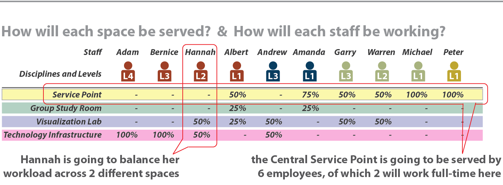

# 6.3 Personalplanung für den Service

Die Abschätzung des benötigten Personals trägt entscheidend dazu bei, zu
verstehen, wie die Serviceleistungen und der Support innerhalb eines
Raumes funktionieren werden. Dies sollte ein iterativer Prozess sein,
bei dem zwischen den geplanten Räumen, der aktuellen Personalausstattung
und dem prognostizierten zusätzlichen Personalbedarf hin und her
gewechselt wird.

 

Um diesen Prozess umzusetzen, muss man vier Schlüsselfaktoren
berücksichtigen:

-   **VZÄ:** Die Gesamtzahl der benötigten Mitarbeiter, in
    Vollzeitäquivalenten (VZÄ). Zum Beispiel könnte 1 studentischer
    Praktikant als 0,5 VZÄ betrachtet werden.

-   **Fachgebiet:** Wie sich das Personal nach Servicebereichen oder
    Fachgebieten aufteilt. Die grundlegendsten könnten öffentliche
    Dienste (z.B.: Serviceschalter), technische Unterstützung, Betreuung
    der Anlagen oder andere Spezialisten sein.

-   **Level/Niveau:** Grad der erforderlichen Erfahrung, Kenntnisse und
    Fähigkeiten, im Allgemeinen in vier Stufen unterteilt, wobei Stufe 1
    die einfachste und Stufe 4 die fortgeschrittenste ist

-   **Raum:** Die Zuordnung von Mitarbeitern zu Räumen oder
    Servicebereichen, z.B. das Verhältnis von Personal am
    Informationsschalter vs. Gruppenarbeitsräume vs. Infrastruktur
    hinter den Kulissen

Das obige Diagramm veranschaulicht, wie man unter Berücksichtigung
dieser verschiedenen Faktoren vorgeht, und die Tabelle unten erklärt die
Funktion und die Kenntnisse/Fähigkeiten, die von den Mitarbeitern je
nach Fachgebiet und Niveau benötigt werden, um dies zu erreichen.

**Mitarbeiterfunktion und -fähigkeiten nach Fachgebieten**

**Technisches Personal**

<table>
<colgroup>
<col style="width: 9%" />
<col style="width: 43%" />
<col style="width: 46%" />
</colgroup>
<thead>
<tr class="header">
<th>Level</th>
<th>Funktion</th>
<th>Fähigkeiten</th>
</tr>
</thead>
<tbody>
<tr class="odd">
<td> L1</td>
<td><ul>
<li>
Front-Line-Interaktionen mit Benutzern
</li>
<li>
Triage (Sichtung)
</li>
<li>
Grundlegende Einrichtung
</li>
<li>
Reagieren auf Probleme
</li>
</ul></td>
<td><ul>
<li>
Vertrautheit mit Technologien
</li>
<li>
Service- und Kommunikationsfähigkeiten
</li>
<li>
Problemlösefähigkeiten
</li>
</ul></td>
</tr>
<tr class="even">
<td> L2</td>
<td><ul>
<li>
Imaging und Einrichtung
</li>
<li>
Fehlerbehebung auf höherer Ebene
</li>
<li>
Unterstützung der Funktionalität von Hi-Tech-Räumen
</li>
<li>
Veranstaltungsaufbau, Präsentation, AV-Unterstützung
</li>
<li>
Proaktiv
</li>
</ul></td>
<td><ul>
<li>
Technisches Können
</li>
<li>
Verständnis des Kontexts
</li>
</ul></td>
</tr>
<tr class="odd">
<td> L2 +</td>
<td><ul>
<li>
Beratung, Schulung auf höherer Ebene
</li>
<li>
Technologiegestaltung und -integration
</li>
<li>
IT-Outreach (Öffentlichkeitsarbeit)
</li>
<li>
Inhaltliche Dienstleistungen und Bereitstellung von Diensten
</li>
<li>
Proaktiv
</li>
</ul></td>
<td><ul>
<li>
Technische Spezialisierung
</li>
<li>
Beratungskompetenz
</li>
<li>
Fachkenntnisse im Bereich der Lehrtechnologie
</li>
<li>
Verständnis für programmatische Bedürfnisse, Kontext, Domänenwissen
</li>
</ul></td>
</tr>
<tr class="even">
<td> L3</td>
<td><ul>
<li>
Entwicklung kundenspezifischer Anwendungen
</li>
<li>
Schnittstellen und Grafiken
</li>
<li>
Systementwicklung
</li>
</ul></td>
<td><ul>
<li>
Einschlägige Ausbildung und Weiterbildung
</li>
<li>
Erfahrung in Bezug auf Plattform/Sprache
</li>
<li>
Kommunikation und Teamarbeit
</li>
</ul></td>
</tr>
<tr class="odd">
<td> L4</td>
<td><ul>
<li>
Systemadministration
</li>
<li>
Systemtechnik
</li>
<li>
Netzwerkdienste
</li>
<li>
Proaktiv
</li>
</ul></td>
<td><ul>
<li>
Einschlägige Ausbildung, Weiterbildung und Berufserfahrung
</li>
<li>
Kommunikation und Teamarbeit
</li>
</ul></td>
</tr>
</tbody>
</table>

**Personal für öffentliche Dienstleistungen**

<table>
<colgroup>
<col style="width: 9%" />
<col style="width: 48%" />
<col style="width: 42%" />
</colgroup>
<thead>
<tr class="header">
<th>Level</th>
<th>Funktion</th>
<th>Fähigkeiten</th>
</tr>
</thead>
<tbody>
<tr class="odd">
<td>L1</td>
<td><ul>
<li>
Frontline-Interaktion mit Nutzern am Serviceschalter
</li>
<li>
Öffnen/Schließen von Gebäuden
</li>
<li>
Überwachen der Sicherheit
</li>
<li>
Terminplanung für Räume und Dienste
</li>
<li>
Empfang
</li>
</ul></td>
<td><ul>
<li>
Vertrautheit mit grundlegenden Computerprogrammen
</li>
<li>
Service- und Kommunikationsfähigkeiten
</li>
<li>
Problemlösefähigkeiten
</li>
</ul></td>
</tr>
<tr class="even">
<td> L2</td>
<td><ul>
<li>
Auf spezielle Anfragen/Probleme reagieren
</li>
<li>
Spezialisierte Dienstleistungen bereitstellen (z.B. Großformatdruck)
</li>
<li>
Desktop-Support anbieten
</li>
<li>
Führungen geben
</li>
<li>
Hardware-Fehlersuche und -Wartung
</li>
<li>
Dienstpläne der Mitarbeiter pflegen
</li>
</ul></td>
<td><ul>
<li>
Mittlere Kenntnisse über spezifische Computerprogramme
</li>
<li>
Verständnis des Kontextes von Lernräumen
</li>
<li>
Fähigkeit, nicht-routinemäßige Probleme zu lösen
</li>
</ul></td>
</tr>
<tr class="odd">
<td> L2+</td>
<td><ul>
<li>
Erweiterter Support für Benutzer, komplexe Probleme beantworten/lösen
</li>
<li>
Personal einstellen, schulen und leiten
</li>
<li>
Dokumentation pflegen
</li>
</ul></td>
<td><ul>
<li>
Technische Spezialisierung, fortgeschrittene Kenntnisse über spezifische Computerprogramme
</li>
<li>
Beratungskompetenz
</li>
</ul></td>
</tr>
<tr class="even">
<td> L3</td>
<td><ul>
<li>
Bei der Erstellung und Aktualisierung von Richtlinien/Strategien unterstützen
</li>
<li>
Teams leiten
</li>
<li>
Unterweisen / Unterrichten
</li>
<li>
Verbindung zu externen Einheiten
</li>
</ul></td>
<td><ul>
<li>
Einschlägige Ausbildung und Weiterbildung
</li>
<li>
Kommunikation und Teamarbeit
</li>
<li>
Management-Fähigkeiten
</li>
</ul></td>
</tr>
</tbody>
</table>

**Beispiel**

Wenn man ein Learning Commons plant und schätzt, dass es mit 11 VZÄ
besetzt sein wird, könnte man am Ende eine Tabelle wie diese erhalten:
Wenn man folgendes weiß (oder abschätzt): (1) die erwartete Anzahl der
VZÄ, (2) die Aufschlüsselung dieser VZÄ nach Disziplin/Bereich und
Dienstalter, und (3) die Verteilung dieser Mitarbeiter nach Raumtyp,
dann geht man direkt zum [**Integrated Budgeting Tool**](../3_projektmanagement/5_Integration.md/#_3.5.2).

<table>
<colgroup>
<col style="width: 28%" />
<col style="width: 14%" />
<col style="width: 21%" />
<col style="width: 19%" />
<col style="width: 16%" />
</colgroup>
<thead>
<tr class="header">
<th> </th>
<th>
Level-1

Basis
</th>
<th>
Level-2

Mittelstufe
</th>
<th>
Level-3

Fortgeschritten
</th>
<th>
Level-4

Experte
</th>
</tr>
</thead>
<tbody>
<tr class="odd">
<td>Öffentliche Dienste</td>
<td>3,0</td>
<td>1,0</td>
<td>0,5</td>
<td>0,5</td>
</tr>
<tr class="even">
<td>Anlagen</td>
<td> </td>
<td>0,5</td>
<td> </td>
<td> </td>
</tr>
<tr class="odd">
<td>IT</td>
<td>2,0</td>
<td> </td>
<td>1,0</td>
<td>1,0</td>
</tr>
<tr class="even">
<td>Andere</td>
<td> </td>
<td>1,5</td>
<td> </td>
<td> </td>
</tr>
<tr class="odd">
<td>Summe VZÄ pro Level</td>
<td><strong>5,0</strong></td>
<td><strong>3,0</strong></td>
<td><strong>1,5</strong></td>
<td><strong>1,5</strong></td>
</tr>
</tbody>
</table>
